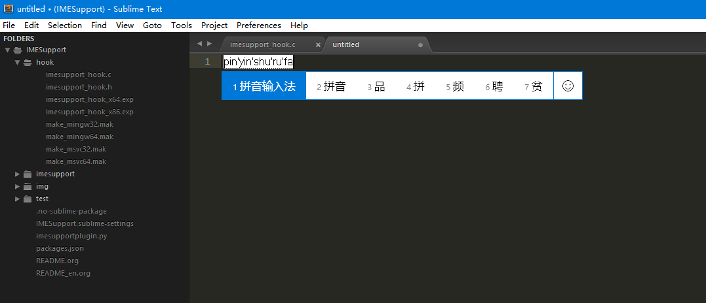

## IMESupport

在 Windows 10 x64 和 Sublime Text 3 Build 3126, 3142 中测试。

Sublime Text 中文输入法支持，解决中文输入法等无法跟随的问题。

该分支使用 Visual Studio 2017 Community 重新编译了 dll，并且支持 Windows 10 中系统自带拼音输入法。

## 安装

注意：这是 [chikatoike/IMESupport](https://github.com/chikatoike/IMESupport) 的 fork 版本，所以不要使用 package_control 安装。

直接将该项目克隆或是下载到 Sublime_Text_3_Install_Path/Data/Packages 目录下。

## 问题

* [ ] 在启用 MarkdownEditing 插件编辑的时候，定位不准
* [X] 在启用或是关闭 side_bar 的时候，定位不准（现在延时 400 毫秒更新计算位置，如果从执行 `toggle_side_bar` 命令开始，400 毫秒内 side_bar 能够完成启用或是关闭的动画或是不做输入，位置计算还算准确，暂时还没有发现接口提供完美解决该问题的能力）。
* [ ] 对于 `console`, `find` 等 panel 的输入位置还不能准确获取或是计算。

## ChangeLog

### 2017-07-31
* 新版本 (dev build 3142) 可以使用 View.text_to_view 获取光标的位置。
* 使用 Visual Studio 2017 Community 重新编译 dll 文件。
